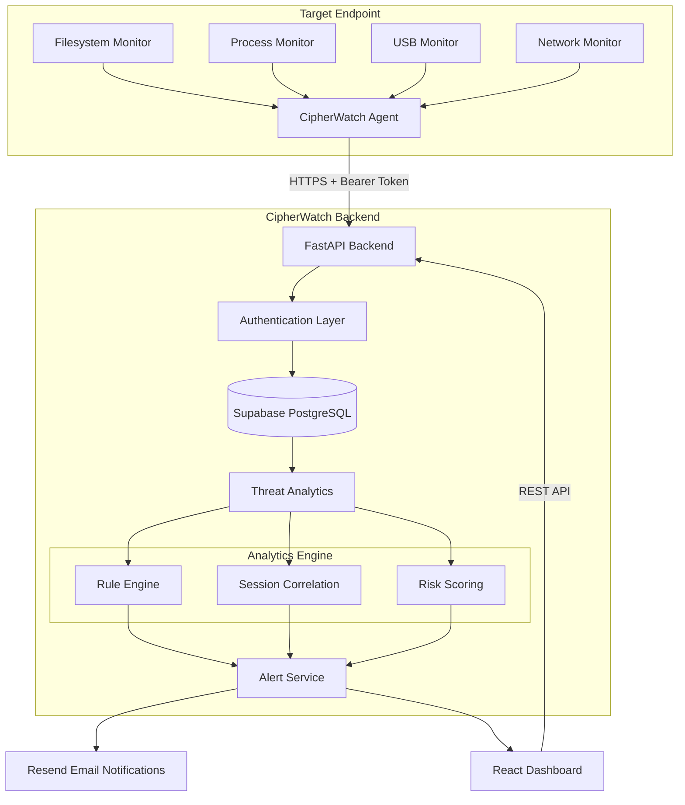

# CipherWatch

> **Privacy-Preserving Endpoint Threat Detection & Behavioral Analytics Platform**

[](https://www.python.org/downloads/)
[](https://fastapi.tiangolo.com/)
[](https://react.dev/)
[](https://opensource.org/licenses/MIT)
[](#-privacy-guarantee)

CipherWatch is a high-performance, privacy-preserving Data Loss Prevention (DLP) and insider threat analytics platform. Designed for modern security operations and privacy-conscious organizations, CipherWatch continuously monitors endpoint telemetry to detect data exfiltration sequences (e.g., archive staging, unauthorized USB transfers, off-hours egress) **without ever inspecting file contents, capturing screenshots, or logging employee keystrokes**.

Traditional DLP software relies on intrusive deep-packet inspection and file content scraping, introducing massive compliance risks, performance overhead, and employee distrust. CipherWatch solves this by decoupling threat intelligence from payload inspection—relying purely on metadata behavior streams, topological session graph analysis, and baseline anomaly detection.

Featuring a standalone C-compiled/PyInstaller Linux endpoint daemon, a multi-tenant FastAPI orchestration backend, and a real-time SOC Analyst Dashboard, CipherWatch provides enterprise-grade threat detection while strictly maintaining zero-privacy invasion guarantees.

---

## 🚀 Features

### 🖥️ Endpoint Agent
- **Filesystem Telemetry:** Monitors file creation, deletion, modification, and rename events (file paths, extensions, byte sizes) via native OS `watchdog` kernel hooks.
- **Process Execution Tracking:** Captures process execution trees, parent-child relationships, command-line flags, CPU/RAM usage, and user execution context using `psutil`.
- **USB Hardware Hotplugging:** Real-time detection of USB mass storage attachments, vendor IDs (`vendor_id`), product IDs (`product_id`), and mount point states.
- **Network Egress Telemetry:** Tracks destination ports, active socket counts, and cumulative bytes sent/received.
- **Heartbeat & Self-Healing:** Periodic telemetry handshakes with state synchronization and persistent token authorization.
- **Secure Auto-Enrollment:** Interactive setup wizard supporting org-scoped enrollment tokens and automated `/etc/cipherwatch/` configuration provisioning.

### 🧠 Threat Detection Engine
- **Rule Engine & Heuristic Correlation:** Multi-variable heuristic checks identifying high-risk combinations (e.g., bulk archive creation + off-hours USB insertion).
- **Session Graph Engine:** Topological Directed Acyclic Graph (DAG) event linkage using `NetworkX` to reconstruct multi-stage insider threat chains.
- **Hybrid ML Risk Scoring:** Statistical per-user baseline deviation (Z-scores) combined with `Isolation Forest` anomaly detection.
- **Deterministic SOC Verdicts:** Zero-telemetry baseline guarantee (0% risk for inactive/empty hosts) with dynamic score normalization (0–100%).

### 📊 SOC Analyst Dashboard
- **Live Fleet Telemetry Stream:** Real-time visibility into enrolled endpoint status, last seen timestamps, IP addresses, and risk badges.
- **Endpoint Detail Deep-Dive:** Dedicated granular view featuring tabbed telemetry feeds (Activity, USB Hardware, File System, Network Egress).
- **Unified Event Timeline:** Searchable, chronological event aggregator sorting process, filesystem, and USB telemetry across endpoints.
- **Interactive Security Email Simulation:** Admin-facing diagnostic modal to simulate and trigger live critical threat alert dispatches.
- **Multi-Tenant Organization Management:** Secure workspace isolation with role-based member management and unique agent enrollment keys.

### 🔒 Security & Privacy Architecture
- **Strict Metadata-Only Telemetry:** Guaranteed zero capture of file content, screen pixels, key logs, or clipboard data.
- **Organization-Scoped Multi-Tenancy:** Enforced DB-level scoping preventing cross-tenant data leakage.
- **Token Hashing & TTL Caching:** In-memory caching for authenticated agent tokens to optimize ingestion throughput.
- **Automated Alert Cooldowns:** Intelligent 1-hour email alert cooldown controls to prevent notification spam and quota exhaustion.

---

## 🏗 Architecture



---

## ⚙ Tech Stack

| Layer | Technologies Used |
| :--- | :--- |
| **Backend API** | Python 3.10+, FastAPI, Uvicorn, Pydantic v2 |
| **Frontend UI** | React 18, Vite, Lucide React, Vanilla CSS (Brutalist Design Tokens) |
| **Database & ORM** | PostgreSQL / Supabase, SQLite, SQLAlchemy 2.0 |
| **Endpoint Agent** | Python 3.11, PyInstaller, `watchdog`, `psutil`, `httpx` |
| **Machine Learning & Graph** | `scikit-learn` (Isolation Forest), `NetworkX` |
| **Email & Alerting** | Resend API, Jinja2 / HTML Email Templates |
| **Deployment & Service** | Systemd, Bash Installers, Docker, Python Subprocess Daemon |

---

## 📂 Project Structure

```
CipherWatch/
├── agent/                  # Standalone Linux Endpoint Agent
│   ├── main.py             # Agent entry point & CLI commands (setup, dev, start, status)
│   ├── monitor.py          # Multithreaded telemetry collectors (FS, Process, USB, Net)
│   ├── publisher.py        # HTTP client & retry logic for event ingestion
│   └── installer/          # Systemd unit files & bash installation scripts
├── backend/                # FastAPI Core Application
│   ├── main.py             # FastAPI app initialization & CORS setup
│   ├── config.py           # Environment settings & Database configuration
│   ├── db/                 # SQLAlchemy Models (Agent, Event, Process, FS, USB, Alert)
│   ├── routes/             # REST API Endpoints (Admin, Agent, Auth, Events, Orgs)
│   ├── services/           # Business Logic (Threat Engine, Email Service, Analytics)
│   └── threat_engine/      # ML Anomaly Detector & Session Graph Correlator
├── frontend/               # React / Vite Dashboard Application
│   ├── src/
│   │   ├── components/     # UI Views (AdminDashboard, UserDetailDashboard, AuthModal)
│   │   ├── index.css       # Global Brutalist CSS Tokens & Animations
│   │   └── App.jsx         # Main App Routing & State Management
│   └── vite.config.js      # Vite build & proxy settings
├── simulator/              # Attack Simulation Engine
│   └── main.py             # Synthetic scenario generator (exfil_burst, slow_drip)
├── start.py                # Single-command launcher for full-stack dev environment
├── build.sh                # Linux Agent Standalone Packaging Script
└── requirements.txt        # Python dependency manifest
```

---

## 🔄 Workflow

```
┌─────────────────┐       ┌─────────────────┐       ┌─────────────────┐
│ 1. Telemetry    │       │ 2. Publisher    │       │ 3. Ingestion    │
│    Collection   │ ────> │    Batching     │ ────> │    & Caching    │
│ (Metadata Only) │       │ (Bearer Token)  │       │ (FastAPI / DB)  │
└─────────────────┘       └─────────────────┘       └─────────────────┘
                                                             │
                                                             ▼
┌─────────────────┐       ┌─────────────────┐       ┌─────────────────┐
│ 6. SOC Analyst  │       │ 5. Alert &      │       │ 4. Threat       │
│    Dashboard    │ <──── │    Notification │ <──── │    Analytics    │
│ (Action Verdict)│       │ (Resend Email)  │       │ (Session Graph) │
└─────────────────┘       └─────────────────┘       └─────────────────┘
```

1. **Telemetry Collection:** The `cipherwatch-agent` monitors local process executions, file system writes/modifications, USB insertions, and network sockets—extracting lightweight metadata without touching payload contents.
2. **Publisher Batching:** Captured events are queued, serialized, and transmitted over HTTPS via authenticated Bearer token payloads.
3. **Ingestion & Caching:** The FastAPI ingestion route validates token hashes via an in-memory TTL cache and persists records into PostgreSQL (`events`, `process_events`, `fs_events`, `usb_events`).
4. **Threat Analytics:** Telemetry triggers the session correlator, building a Directed Acyclic Graph (DAG) of user activity. The Isolation Forest model computes anomaly scores relative to historical endpoint baselines.
5. **Alert & Cooldown Handling:** If risk exceeds critical thresholds ($\ge 75\%$), an Alert record is registered, and an email notification is dispatched via Resend (enforcing a 1-hour cooldown window per alert type).
6. **SOC Dashboard Update:** Real-time fleet metrics, updated risk scores, and event timelines are immediately surfaced to security analysts via the React SOC Dashboard.

---

## 📸 Screenshots

### Fleet Overview & Risk Matrix

*Real-time fleet monitoring matrix displaying endpoint statuses, threat badges, and organization health metrics.*

---

### Endpoint Telemetry & Deep-Dive Investigation

*Granular endpoint view displaying live USB hardware events, process execution logs, and deterministic SOC verdicts.*

---

### Unified Event Timeline

*Chronological event feed consolidating filesystem changes, process creations, and USB attachments across endpoints.*

---

### Security Email Diagnostic Modal

*Interactive diagnostic modal allowing SOC administrators to simulate threat alerts and verify Resend email delivery.*

---

### Critical Threat Security Alert

*Automated HTML threat alert delivered via Resend API detailing threat severity, risk score, and affected endpoints.*

---

## 🚀 Getting Started

### Prerequisites
- **Operating System:** Linux (Ubuntu/Debian, RHEL, Fedora, Arch) or macOS / Windows for server execution
- **Python:** Python 3.10 or higher
- **Node.js:** Node.js v18+ and `npm`

---

### 1. Clone the Repository
```bash
git clone https://github.com/TanishqRaut1812/CipherWatch.git
cd CipherWatch
```

---

### 2. Environment Configuration
Create a `.env` file in the project root:
```env
# Database Configuration
DATABASE_URL=sqlite:///./cipherwatch.db

# JWT & Authentication Secrets
JWT_SECRET_KEY=cipherwatch_super_secret_production_key_change_me
JWT_ALGORITHM=HS256
ACCESS_TOKEN_EXPIRE_MINUTES=1440

# Resend Email Integration (Optional for live email dispatch)
RESEND_API_KEY=re_your_resend_api_key_here
SENDER_EMAIL=alerts@yourverifieddomain.com
```

---

### 3. Quick Start (Single-Command Development Mode)
Run the automated multi-process supervisor to launch backend, frontend, and synthetic telemetry injectors simultaneously:

```bash
# Install Python dependencies
pip install -r requirements.txt

# Install Frontend dependencies
cd frontend && npm install && cd ..

# Launch backend, frontend, and simulation engines
python start.py
```
Access the SOC Dashboard in your browser at **`http://localhost:5173`**.

---

### 4. Standalone Linux Agent Setup
To deploy the endpoint daemon on a target Linux machine:

```bash
# 1. Build executable package
chmod +x build.sh
./build.sh

# 2. Install binary & systemd unit
cd build
sudo ./install.sh

# 3. Enroll Agent with Server
cipherwatch-agent setup

# 4. Start Background Daemon
sudo systemctl start cipherwatch-agent
```

---

## 🔒 Privacy Guarantee

CipherWatch is engineered under a foundational **Zero-Privacy Invasion Policy**. The platform is strictly prohibited from capturing payload contents or private user artifacts.

| Data Category | Collection Status | Technical Implementation |
| :--- | :---: | :--- |
| **File Contents** | 🚫 **NEVER** | No payload reading; only file paths, extensions, and byte sizes collected |
| **Keystrokes & Passwords** | 🚫 **NEVER** | Zero keylogger hooks or raw input monitoring |
| **Screen Capture & Video** | 🚫 **NEVER** | No display frame buffer reading or screenshot generation |
| **Clipboard & Buffer** | 🚫 **NEVER** | No clipboard monitoring or memory dumping |
| **Audio & Video Streams** | 🚫 **NEVER** | Zero microphone or webcam access |
| **Process Executions** | ✅ **METADATA ONLY** | PID, binary name, execution path, CPU/RAM usage % |
| **Filesystem Activity** | ✅ **METADATA ONLY** | Action type (create/modify/delete), extension, file size delta |
| **USB Storage Attachments** | ✅ **METADATA ONLY** | Action (connect/disconnect), Vendor ID, Product ID, Mount path |
| **Network Endpoints** | ✅ **METADATA ONLY** | Remote IP, destination port, cumulative egress byte count |

---

## 🗺 Roadmap

- [ ] **MITRE ATT&CK Framework Mapping:** Automatic correlation of detected anomaly graphs against official MITRE ATT&CK tactics (T1052 - Exfiltration Over Removable Media, T1074 - Data Staged).
- [ ] **Active Response & Isolation:** Automated host isolation (network firewall locking) triggered directly from SOC verdict actions.
- [ ] **Graph Neural Network (GNN) Analytics:** Upgrading the topological session engine to use GNN embeddings for multi-user collaborative threat detection.
- [ ] **SIEM Enterprise Connectors:** Native forwarding integrations for Splunk HTTP Event Collector (HEC), Elastic Security, and Microsoft Sentinel.
- [ ] **Cross-Platform Endpoint Agents:** Extending native C-compiled agent binaries to macOS (`launchd`) and Windows (`Windows Service`).

---

## 👥 Team

- **Tanishq Raut** - Lead Architect & Core Backend Engineer
- **CipherWatch Team** - Hackathon Contributors & Security Research

---

## 📄 License

This project is licensed under the **MIT License** - see the [LICENSE](LICENSE) file for complete details.
