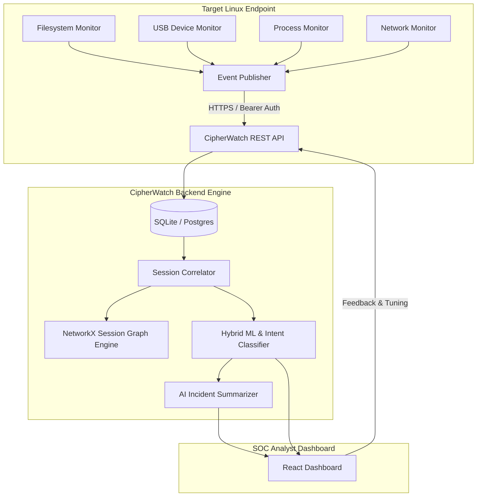

# CipherWatch 🛡️

> **Privacy-Preserving, Metadata-Only Endpoint Insider Threat Detection & Intent Reconstruction Platform**

CipherWatch is an enterprise-grade endpoint security and threat intelligence platform designed to detect insider data exfiltration (USB transfers, cloud uploads, off-hours archive staging) using **strict metadata telemetry** — file paths, sizes, extensions, process trees, network endpoints, and device IDs — **without ever reading file contents, capturing screenshots, or logging keystrokes**.

---

## 🌟 Key Features & Capabilities

- 🐧 **Standalone Linux Endpoint Agent**: Native Linux binary (compiled via PyInstaller) running as a systemd daemon. Zero Python dependency on target endpoints.
- 🔒 **Zero-Privacy Invasion Guarantee**: Operates strictly within privacy boundaries. Captures metadata only; never inspects file contents, screen pixels, or keystrokes.
- 🏢 **Multi-Tenant Fleet Architecture**: Organization-scoped agent enrollment with unique per-device tokens (`/api/agent/enroll`), heartbeat management, and isolated telemetry ingestion.
- 🕸️ **Session Graph Engine**: Uses NetworkX topological analysis to link multi-hop exfiltration vectors (e.g., `FILE_CREATE (.7z)` ➔ `USB_INSERT` ➔ `NETWORK_CONNECT (anonfiles.com)`).
- 🧠 **Hybrid ML Risk Engine**: Multi-tier scoring using Isolation Forest anomaly detection, per-user baseline deviation (Z-scores), and Random Forest intent classification.
- 💬 **AI Incident Explainability**: Generates plain-English, action-oriented incident summaries for SOC analysts using LLM prompt construction without exposing raw payload data.
- 📊 **Real-Time SOC Dashboard**: Modern React/Vite dashboard featuring SVG risk time-series charts, interactive timeline visualizers, and privacy audit modals.

---

## 🏗️ System Architecture



---

## 🛠️ Tech Stack

- **Endpoint Agent:** Python 3.11, PyInstaller, `watchdog`, `psutil`, `httpx`, `pydantic`
- **Backend Service:** Python 3.10+, FastAPI, SQLAlchemy, SQLite/PostgreSQL, Uvicorn
- **Analytics & ML:** `scikit-learn` (Isolation Forest, Random Forest), `NetworkX`
- **LLM Integration:** Anthropic API (Claude 3.5 Sonnet / Haiku)
- **Frontend App:** React 18, Vite, SVG Time-Series Visualizer, Vanilla CSS Tokens

---

## 🚀 Quickstart Guide

### Prerequisites
- Linux OS (Ubuntu/Debian, RHEL, Fedora, Arch) with `systemd`
- Python 3.10+
- Node.js (v18+) & npm

---

### Option A: Complete Local System Launch (One Command)

To run the Backend Service, Frontend Dashboard, and Synthetic Data Injector simultaneously:

```bash
# 1. Install backend dependencies
pip install -r requirements.txt

# 2. Install frontend dependencies
cd frontend && npm install && cd ..

# 3. Launch full stack
python start.py
```
Open **`http://localhost:5173`** in your browser to access the SOC Dashboard.

---

### Option B: Standalone Linux Endpoint Agent Deployment

Build and deploy the CipherWatch Linux Endpoint Agent as a production-grade binary executable with systemd lifecycle management.

#### Step 1: Build the Standalone Package

```bash
# Grants executable permissions and builds deployment bundle in build/
chmod +x build.sh
./build.sh
```

This populates the `build/` directory with:
- `build/cipherwatch-agent` (Native binary executable)
- `build/install.sh` (Installer script with upgrade detection)
- `build/cipherwatch-agent.service` (Systemd unit file)

#### Step 2: Install to Linux Endpoint System

```bash
cd build
sudo ./install.sh
```

#### Step 3: Enroll Endpoint Agent

```bash
cipherwatch-agent setup
```
Follow the interactive prompt to enter your **Server URL**, **Organization ID**, and **Enrollment Key**.

#### Step 4: Start the Agent

- **Development Mode** (Foreground, verbose console logging, Ctrl+C supported):
  ```bash
  cipherwatch-agent dev
  ```

- **Production Mode** (Systemd background daemon):
  ```bash
  sudo systemctl start cipherwatch-agent
  # or via CLI:
  cipherwatch-agent start
  ```

---

## 📖 CLI Command Reference

The `cipherwatch-agent` binary provides full management capabilities:

| Command | Usage | Description |
| :--- | :--- | :--- |
| **`setup`** | `cipherwatch-agent setup` | Interactive wizard to enroll endpoint with CipherWatch backend. |
| **`dev`** | `cipherwatch-agent dev` | Runs agent in foreground with verbose console logging (dev only). |
| **`start`** | `cipherwatch-agent start` | Starts installed systemd background service. |
| **`stop`** | `cipherwatch-agent stop` | Stops running systemd background service. |
| **`restart`** | `cipherwatch-agent restart` | Restarts installed systemd service (`stop` -> `start`). |
| **`sync`** | `cipherwatch-agent sync` | Forces immediate heartbeat and verifies backend connection. |
| **`status`** | `cipherwatch-agent status` | Displays enrollment, service, PID, heartbeat, and path status. |
| **`logs`** | `cipherwatch-agent logs -n 50` | Displays the last N lines of `/etc/cipherwatch/logs/cipherwatch.log`. |
| **`uninstall`** | `cipherwatch-agent uninstall [--purge]` | Removes service and binary. Optional `--purge` deletes configuration. |
| **`version`** | `cipherwatch-agent version` | Displays agent version, build date, and git commit hash. |

---

## 📂 System Paths & Storage Layout

On Linux endpoints, CipherWatch adheres strictly to OS filesystem standards:

| Path | Purpose | Access Permissions |
| :--- | :--- | :--- |
| **/etc/cipherwatch/config.json** | Endpoint IDs, auth tokens, server URL | `600` (Root / Owner) |
| **/etc/cipherwatch/logs/cipherwatch.log** | Rotating log file (10MB max, 5 backups) | `600` |
| **/etc/cipherwatch/state.json** | Last heartbeat & event telemetry state | `600` |
| **/etc/cipherwatch/cipherwatch-agent.pid** | Process lock file (prevents duplicate instances)| `600` |
| **/usr/local/bin/cipherwatch-agent** | Executable standalone binary | `755` |
| **/etc/systemd/system/cipherwatch-agent.service** | Systemd unit configuration file | `644` |

*Note: Unprivileged executions automatically fall back to `~/.config/cipherwatch/`.*

---

## 🧪 Synthetic Attack Simulations

To simulate insider threat scenarios without generating actual physical events:

```bash
# Scenario 1: Routine Developer Workflow (Normal Baseline / Low Risk < 20%)
python -m simulator.main --scenario normal_day

# Scenario 2: Exfiltration Burst (Bulk archive creation + USB transfer > 85%)
python -m simulator.main --scenario exfil_burst

# Scenario 3: Low-and-Slow Exfiltration (Off-hours staging + cloud upload)
python -m simulator.main --scenario slow_drip
```

---

## 🔒 Zero-Privacy Invasion Guarantee

CipherWatch operates under strict enterprise privacy boundaries:

| Data Type | Status | Collected Metadata |
| :--- | :---: | :--- |
| **File Contents & Text** | 🚫 **NEVER** | None |
| **Screenshots & Video** | 🚫 **NEVER** | None |
| **Keystrokes & Passwords**| 🚫 **NEVER** | None |
| **Audio & Video Streams** | 🚫 **NEVER** | None |
| **Filesystem Activity** | ✅ **METADATA** | Timestamps, file size (bytes), file extensions, event type |
| **USB Activity** | ✅ **METADATA** | Vendor ID, Product ID, Mount point |
| **Process Tree** | ✅ **METADATA** | Process name, PID, SHA-256 binary hash |
| **Network Endpoints** | ✅ **METADATA** | Remote IP, destination port, domain name |

---

## 🧪 Automated Testing

Execute unit and integration test suites:

```bash
pytest
# or via uv:
uv run pytest
```

---

## 📄 License

Distributed under the MIT License. See `LICENSE` for details.    
